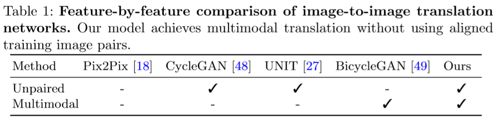
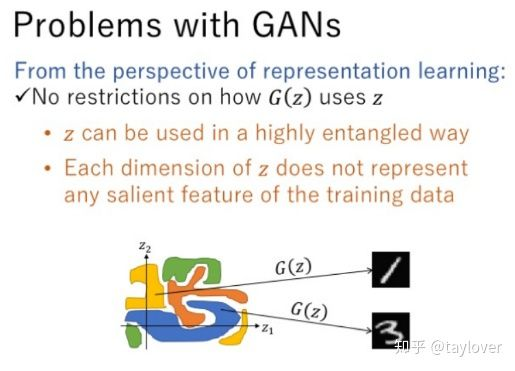
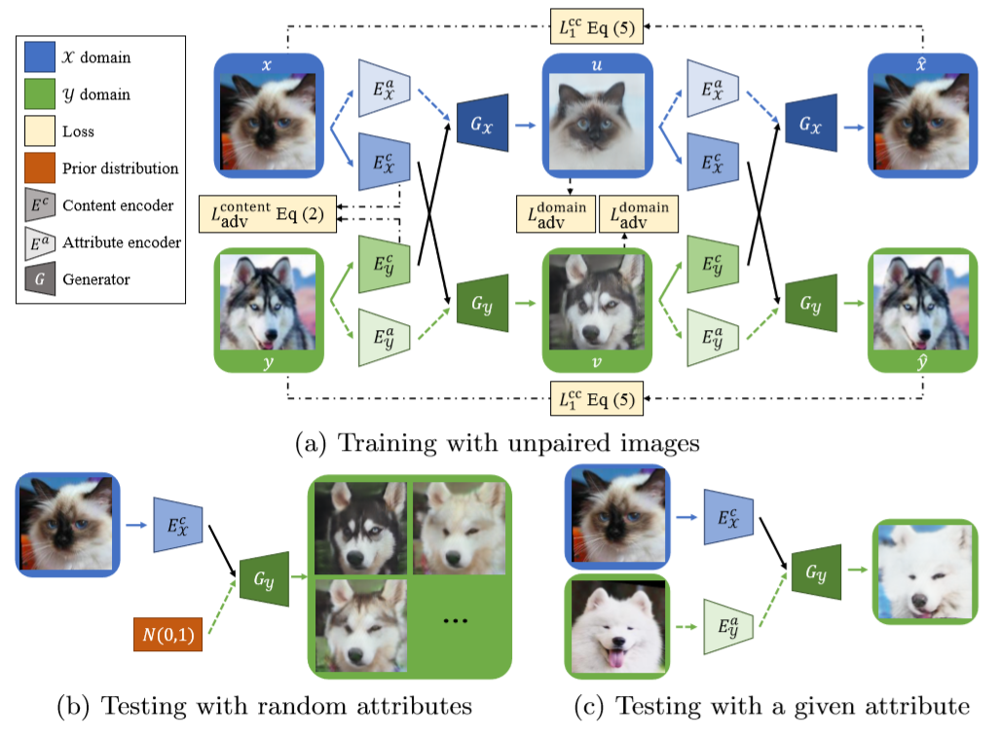
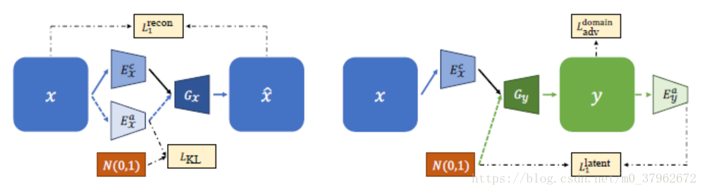
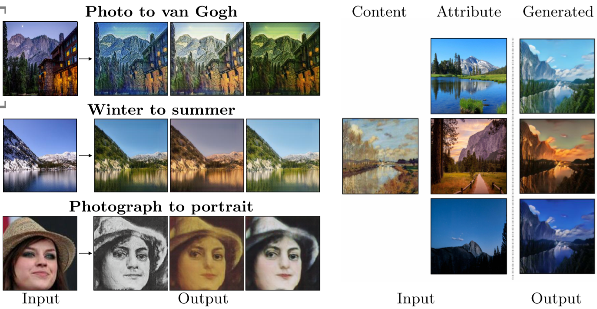
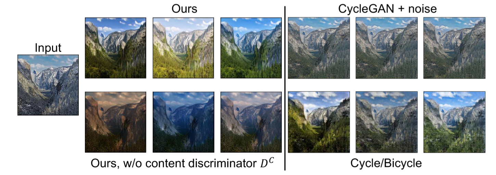

# Note-for-DRIT
make some notes for the paper called DRIT

论文名称：Diverse Image-to-Image Translation via Disentangled Representations

论文地址：[https://arxiv.org/abs/1808.00948](https://arxiv.org/abs/1808.00948)

代码地址：[https://github.com/HsinYingLee/DRIT](https://github.com/HsinYingLee/DRIT)

与我们所熟知的Pix2Pix，CycleGAN一样，这篇文章所做的工作也是通过GAN实现I2I(image-to-image)。那么它们的区别是什么呢？为此，作者专门贴了一张图来说明它们之间的区别。



从上表可以看出，最早的Pix2Pix模型使用的是成对的数据来训练，然而实际情况中成对的数据难以获得或是获得的代价很大，这给Pix2Pix的应用带来了一定局限性；CycleGAN虽然解决了不成对数据的转换问题，但是它和Pix2Pix一样，都是单一态输出，即对于一幅输入图片，只有一种风格的图片输出。之后的UNIT和BicycleGAN也是如此，在二者之间不能均衡。所以，这篇文章的贡献就很明显了：第一，在缺少成对数据的情况下仍然能够实现I2I；第二，对单一的输入有着不同风格的多模态输出。

为了得到多模态的输出，这篇文章用到了一个叫Disentangled Representation的方法，即解耦表示，这是个什么东东呢？通常，我们学到的特征是混杂在一起的，这些特征在数据空间中以一种复杂的无序的方式进行编码，但是如果这些特征是可分解的，那么这些特征将具有更强的解释性，我们将更容易利用这些特征进行编码。其实，在GAN中，由于生成器的输入z是一个连续的噪声信号，并且没有任何约束，导致GAN无法利用这个z，并且无法将z的具体维度和生成数据的语义特征对应起来，不具有可解释性（比如对于手写数字问题，我们不知道什么样的噪声生成1，什么样的噪声生成数字2，影响生成数字大小，角度的是z的哪一维特征）。也正因为如此，GAN网络有着令人诟病的模式崩溃问题(mode collapse)，生成样本类型单一。InfoGAN是第一个提出用解耦表示来解决这个问题的。它把输入到生成器的噪声分为两部分：输入的普通噪声向量z和对应的语义向量c。但如果直接这样作为网络的输入，生成器还是会忽略隐藏编码c的作用，或者看成z与c相互独立。于是，InfoGAN提出应该最大化隐藏编码c与生成样本G(z,c)之间的互信息，这样c才能更好的影响到对应的生成样本，增加生成样本的多样性。



本文借鉴了InfoGAN的思想，将一张图片看成主要是由内容(content)和特性(attribute)两部分组成，用两个Encoder分别去学习这两种特征。内容可以看成是图像的低级特征，比如朝向，边缘等；而特性，或者说是风格，可以看作是图像的高级特征，如纹理，颜色，样式等。不同domain的图像共享内容编码空间C而独享风格编码空间A。它的整体框架如下图所示：



本文的目标是用GAN学习两个domain X，Y之间的映射关系。网络由两个内容编码器$E_X^c，E_Y^c$，两个属性编码器$E_X^a，E_Y^a$，两个生成器$G_X，G_Y$，两个判别器$D_X，D_Y$以及一个内容判别器$D^c$组成。内容编码器和属性编码器分别学习各自domain的内容和属性编码，然后交换attribute，送入相应domain的生成器，便可以实现cross-domain的图像转换了；2个生成器分别用于学习两种不同风格的图片，而2个判别器就用来判别生成的结果在相应domain上是否逼真；至于内容判别器的引入，作者基于这样一个假设：不同风格图片的内容由于不包含特征信息（理想情况下），应该是不可区分的（比如猫的内容编码$E_X^c$和狗的内容编码$E_Y^c$应该足够接近以至于$D^c$无法区分，而$D^c$应该尽可能把它们辨别出来）。借鉴了UNIT，作者提出了两个策略：

1. weight-sharing：两个内容编码器的最后一层共享参数，保证两个内容分布一致；两个生成器第一层共享参数。
2. content discrimination：判别器无法区分$E_X^c$或$E_Y^c$是哪一类，损失函数定义如下：

$$
L_{adv}^{content}(E_X^c,E_Y^c,D^c)=E_x[\frac{1}{2}logD^c(E_X^c(x))+\frac{1}{2}log(1-D^c(E_X^c(x)))]\\
+E_y[\frac{1}{2}logD^c(E_Y^c(y))+\frac{1}{2}log(1-D^c(E_Y^c(y)))]
$$

```
Tip：将上式中的1，2，3，4项进行1，4组合，2，3组合，就可以看作是GAN的损失函数了。但不同于GAN中真伪分明，内容判别器只是将两者区分开，而不是辨别真伪，所以二者均衡取平均（个人理解）。
```

为了实现无监督，和CycleGAN一样，本文同样用了循环一致损失，即两个domain中各自生成的图片再次交换属性之后，应该能基本重建出各自的原始图像。cross-cycle consistency loss定义如下：
$$
L_1^{cc}(G_X,G_Y,E_X^c,E_Y^c,E_X^a,E_Y^a)=E_{x,y}[||G_X(E_Y^c(v),E_X^a(u))-x||_1+||G_Y(E_X^c(u),E_Y^a(v))-y||_1]
$$
其中u和v分别是中间生成的图像。除了这两个损失之外，作者还引入了其他4个损失如下：

- Domain adversarial loss。即生成的图像与相应域的真实图像要足够相似。
- Self-reconstruction loss。图像分解再生成应该与原图像一致（没有交换属性）。
- KL loss。为了测试时能随机采样，我们期望属性表示接近高斯分布，即属性表示的分布与高斯分布的KL距离要足够小。
- Latent regression loss。促进可逆的图像和隐空间映射，即用高斯分布中提取的隐藏向量z与内容表示生成的图片再经过属性编码应该能还原出z。



下图给出了本文的实验结果。如图所示，本文可以实现两种类型的风格转换，左图：给定输入，和服从正态分布的随机噪声（引入KL损失的原因），即可得到风格转换图；右图：给定两张输入，通过编码器分别获得两张图片的Attribute，通过交换Attribute进行风格转换。



文章还对比了不同方法的效果。可以看到，单独的引入噪声并不能产生多模态的输出，内容判别器也确实在生成图像的多样性方面有着很大的贡献。




Word and Expression：

- Image-to-image translation aims to learn the mapping between two visual domains.
- a domain-invariant content space capturing shared information across domains.
- Furthermore, I2I translation has recently shown promising results in facilitating domain adaption.
- our model compares favorably against existing I2I models.
- Recent years have witnessed rapid progress on......
- The task of learning disentangled representation aims at modeling the factors of data variations.
- Domain adaption techniques focus on addressing the domain-shift problem between a source and target domain.
- aforementioned 前述的           other than 除此以外
- exponential 指数的                   pseudo 伪的